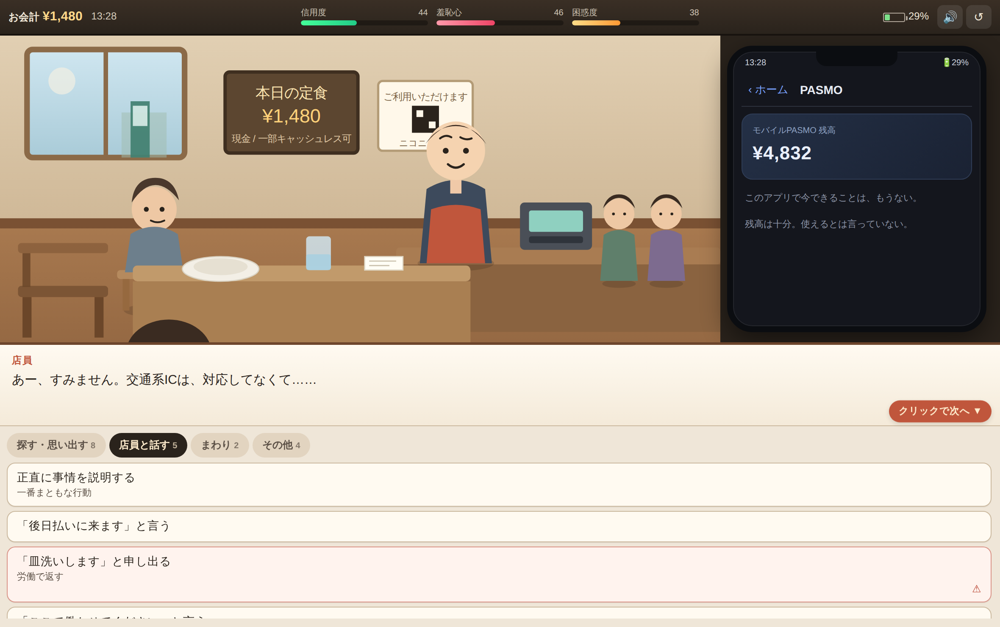

# お会計になります

> 財布を忘れた。ただそれだけの、決済脱出アドベンチャー。

ブラウザだけで遊べる短編ノベルゲームです。ビルド不要・外部依存なし・通信なし。

定食屋で食事を終えた主人公。「お会計、1,480円になります」と言われて財布を探すと、ない。
でも焦らない。**今どき、スマホがあれば何とかなるだろ。**

そこから、スマホ決済・モバイルPASMO・LINE・電話・銀行振込・隣の客・店員との交渉と、
思いつく限りの手段を試していきます。どれも、あと一歩のところで使えません。

一周 10〜20 分 / エンディング 7 種。



---

## 遊ぶ

| 方法 | 手順 |
| --- | --- |
| そのまま | `dist/okaikei.html` をダブルクリック |
| ローカルサーバ | `python3 -m http.server 8000` → http://localhost:8000 |
| GitHub Pages | Settings → Pages → Source: **GitHub Actions** （`.github/workflows/pages.yml` が配信します） |

スマートフォンでも遊べます（スマホでは画面右下の「📱 スマホ」ボタンで端末画面を開きます）。

**操作**: クリック／タップで会話を進める（スペース・Enter でも可）。会話中は選択肢が灰色になり、
どこをクリックしても会話送りになります。セーブはありません。リトライは一瞬です。

---

## 中身

- **行動 93 種** — 大半に固有のテキストとリアクション。同じポケットを 5 回探せます。
- **枝分かれ式の解放** — 最初は 31 種だけ。何かを試すと「じゃあこれは？」が増えていきます。
- **パラメータ** — 信用度 / 羞恥心 / 店員の困惑度（表示）＋ 逃亡犯感 / 面倒な客度 / 店員の優しさ / 周囲の注目度（隠し。エンディングで開示）。
- **時間とバッテリー** — 12 分でレジに列。30 分で店員の休憩が消える。スマホは 47% スタートで、0% になると手段がほぼ全部死ぬ。
- **エンディング 7 種** — 友よ / 後日で結構ですよ / 皿洗い / スマホを置いていく / 逃亡犯 / 大ごと / **ありました**。

店員は最後まで良い人です。焦っているのは主人公だけです。

---

## 開発

分割ソースを編集し、配布用の 1 枚 HTML はビルドで作ります。

```bash
node build.js          # index.html + css + js → dist/okaikei.html
```

Node の標準モジュールしか使っていないので、`npm install` は不要です。

### 構成

```
.
├── index.html                    開発用エントリ（css / js を読み込む）
├── css/
│   └── style.css                 全スタイル
├── js/
│   ├── engine-core.js            音・状態・HUD・シーン描画・会話プレイヤー
│   ├── data-actions-basic.js     アプリ定義と、探す／その他の行動
│   ├── data-actions-phone.js     スマホ各アプリの行動
│   ├── data-actions-people.js    隣の客・店員との会話
│   ├── data-story.js             フラグ・トーク履歴・イベント・エンディング
│   └── main.js                   進行エンジン・描画・開始とリスタート
├── build.js                      単一ファイルビルド
└── dist/okaikei.html             生成物（配布用・そのまま遊べる）
```

`js/*.js` は読み込み順に依存します（`index.html` の `<script>` の並び順）。
ファイルを増やすときは `index.html` にタグを足すだけで、`build.js` は自動で拾います。

### 行動を 1 つ足す

`js/data-actions-*.js` の `ACTS` に 1 オブジェクト足すだけです。

```js
{
  id:'chair_again', cat:'search',       // cat: search / clerk / around / misc / phone
  label:'もう一度、椅子の下を見る',
  sub:'さっきは見落としたかもしれない',
  lines:[                                // who: me / inner / sys / clerk / mgr / nb / ai / friend …
    ['me','もう一度かがむ。'],
    ['sys','ない。'],
    ['inner','ないものは、二度見てもない。']
  ],
  fx:{ shame:3, conf:2 },                // パラメータ変動（省略可）
  unlock:['table_under'],                // 解放する行動 id（省略可）
  max:2, keep:true,                      // 繰り返し可能にする場合
  linesBy:[ /* 1回目 */, /* 2回目 */ ],   // 回数ごとに別テキストにする場合
  time:2, batt:-3,                       // 経過分数 / バッテリー増減（省略可）
  risky:'確認ダイアログに出す文言',        // 取り返しがつかない選択肢
  end:'bad_dish'                         // 直行するエンディング id
}
```

`lines` の 3 要素目で演出を指定できます。

| キー | 効果 |
| --- | --- |
| `face` | 店員の表情 `smile` / `worry` / `confused` / `gentle` / `blank` |
| `emote` / `nbEmote` | 店員・隣客の頭上に出る記号 |
| `fx` | `black`（暗転） / `unblack` / `shake` |
| `drama` | 暗転中に出す大きな文字 |
| `sfx` | `ok` / `fail` / `deny` / `drama` / `ring` / `ding` / `buzz` |
| `slow` | 文字送りを遅くする（間を取りたいとき） |

エンディングは `js/data-story.js` の `ENDINGS` に、時間や状態で自動発火する演出は
同ファイルの `EVENTS` に足します。TRUE END は「28 種類試す or 38 手」で自動発火します
（`js/main.js` の `afterAction()`）。

---

## ライセンス

MIT License. 詳細は [LICENSE](LICENSE) を参照してください。
（著作権表示の氏名は、公開前にご自身のものへ書き換えてください。）

登場する決済サービス・アプリはすべて架空のパロディで、実在のサービスとは関係ありません。
